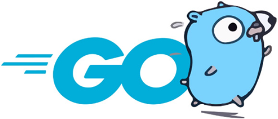

    

 

<picture>
  <source media="(prefers-color-scheme: dark)" srcset="./assets/images/gopher_snacks_low_size_dark.png">
  <source media="(prefers-color-scheme: light)" srcset="./assets/images/gopher_snacks_low_size.png">
  
</picture>

- 🖖 Hi, I’m A7103
  
- 🌱 Currently learning  

- ⛵ Passionate about open source.
  
- 💬 If you have any questions about my code or want to contact me, [please submit an issue](https://github.com/A7103/issue/issues/new)

<picture>
  <source media="(prefers-color-scheme: dark)" srcset="./assets/images/github-profile-details-dark.svg" >
  <source media="(prefers-color-scheme: light)" srcset="./assets/images/github-profile-details.svg">
  
</picture>

<picture>
  <source media="(prefers-color-scheme: dark)" srcset="./assets/images/github-productive-time-dark.svg">
  <source media="(prefers-color-scheme: light)" srcset="./assets/images/github-productive-time.svg">
  
</picture>

<picture>
  <source media="(prefers-color-scheme: dark)" srcset="./assets/images/github-snake-dark.svg">
  <source media="(prefers-color-scheme: light)" srcset="./assets/images/github-snake.svg">
  
</picture>
