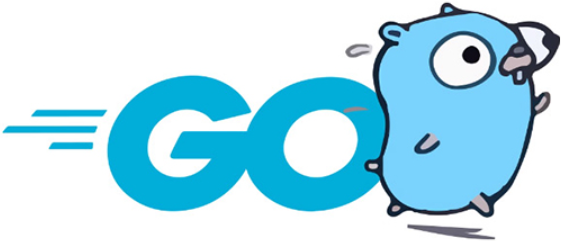

    

 

<picture>
  <source media="(prefers-color-scheme: dark)" srcset="./assets/images/go-icon-dark.png">
  <source media="(prefers-color-scheme: light)" srcset="./assets/images/go-icon-light.png">
  
</picture>

- 🖖 Hi, I’m Pan
  
- 🌱 Currently learning  

- ⛵ Passionate about open source.
  
- 💬 If you have any questions about my code or want to contact me, [please submit an issue](https://github.com/A7103/issue/issues/new)

<picture>
  <source media="(prefers-color-scheme: dark)" srcset="http://github-profile-summary-cards.vercel.app/api/cards/profile-details?username=A7103&theme=github_dark" >
  <source media="(prefers-color-scheme: light)" srcset="http://github-profile-summary-cards.vercel.app/api/cards/profile-details?username=A7103&theme=github">
  
</picture>

<picture>
  <source media="(prefers-color-scheme: dark)" srcset="http://github-profile-summary-cards.vercel.app/api/cards/productive-time?username=A7103&theme=github_dark">
  <source media="(prefers-color-scheme: light)" srcset="http://github-profile-summary-cards.vercel.app/api/cards/productive-time?username=A7103&theme=github">
  
</picture>

<picture>
  <source media="(prefers-color-scheme: dark)" srcset="./assets/images/github-snake-dark.svg">
  <source media="(prefers-color-scheme: light)" srcset="./assets/images/github-snake.svg">
  
</picture>
