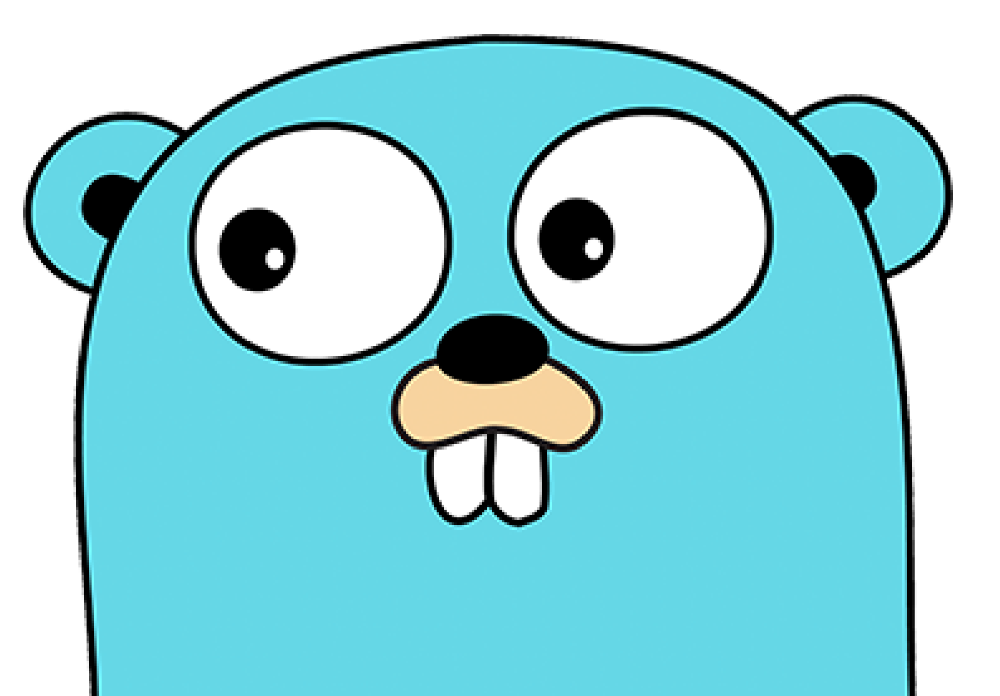

### Hey, coder 

- 🖖 Hi, I’m A7103
- 🌱 I’m currently learning and developing 
- 💬 If you have any question about my code, please summit a issue

<!-- ##  I’m currently learning
 &nbsp; Rust -->
<!---
A7103/A7103 is a ✨ special ✨ repository because its `README.md` (this file) appears on your GitHub profile.
You can click the Preview link to take a look at your changes.
--->
